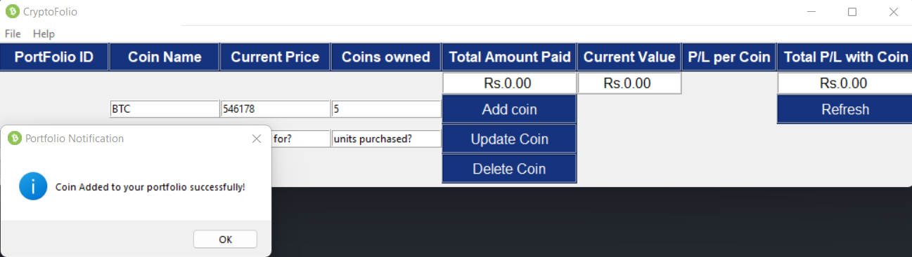

# CryptoFolio Application
---

### An Application that will track your purchases on Crypto Market and saves the data on local database for later profit and loss Analysis.

 ## Requirements
 - Python 3.x and above
 - Tkinter Library(built-Ins)
 - sqlite3 Library (built-Ins)
 - pyinstaller

## Making the standalone file
```
pip install pyinstaller
pyinstaller --onefile -w frontend.py
```

## Screenshots
- ##### Adding a new COIN to the Application 
 

- ##### Applicaion displaying Profit/loss


- ##### Existing Coins can be updated 


